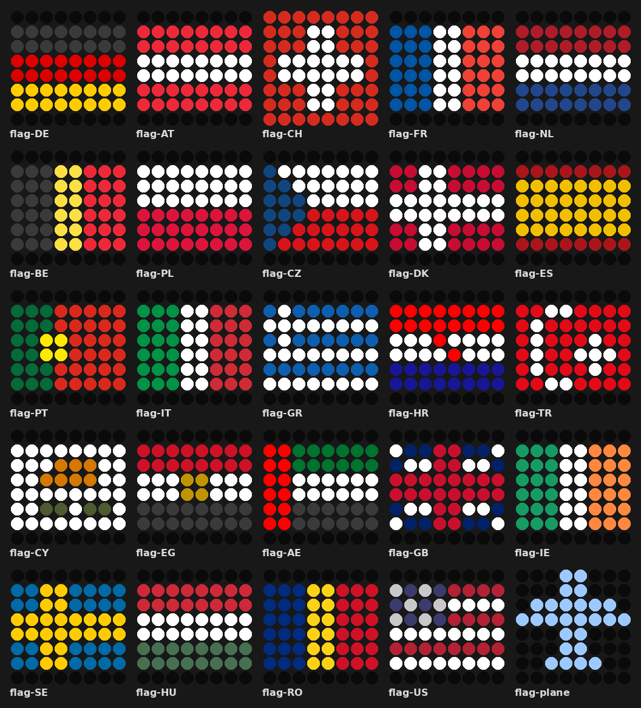

# ✈️ FlightDisplay: Who's flying over me?

Shows aircraft flying over your home – including callsign, route and a flag of the destination country – on your [AWTRIX](https://blueforcer.github.io/awtrix-ng/).


```
DLH01E | Frankfurt (DE) -> Barcelona (ES)   [🇪🇸 flag icon]
```

FlightDisplay is available as a **Home Assistant blueprint** (recommended) and as the original **Node-RED flow**.

---

## Home Assistant blueprint

[](https://my.home-assistant.io/redirect/blueprint_import/?blueprint_url=https%3A%2F%2Fgithub.com%2FmatzZz%2Fflightdisplay%2Fblob%2Fmain%2Fblueprints%2Fflightdisplay.yaml)

### Features

- Uses the free [Flightradar24 integration](https://github.com/AlexandrErohin/home-assistant-flightradar24) – no API key, no account
- Shows callsign, origin and destination city with country code
- 8×8 flag icon of the destination country, with a fallback plane icon
- Optional sound that automatically stays muted during configurable quiet hours
- Every aircraft is announced only once when it enters your radius
- Flights without a known route are skipped
- Everything configurable in the UI – no helpers, no YAML editing

### Requirements

- Home Assistant with [HACS](https://hacs.xyz/)
- MQTT integration connected to the broker your AWTRIX uses
- An AWTRIX running [AWTRIX NG](https://blueforcer.github.io/awtrix-ng/)

### Setup

**1. Install the Flightradar24 integration**

Install **Flightradar24** via HACS, restart Home Assistant, then add it under *Settings → Devices & services*.
Enter your coordinates and the radius.

> ⚠️ The radius is in **meters**, not kilometers. 5 nautical miles ≈ `9260`.

**2. Upload the flag icons to your AWTRIX**

Unzip [`icons/awtrix_flags.zip`](icons/awtrix_flags.zip) and upload all GIF files to the `/ICONS` folder of your AWTRIX – either via drag & drop in the web interface, or all at once from the command line:

```bash
# macOS / Linux
for f in *.gif; do curl -X POST "http://<awtrix-ip>/api/v1/files?dir=/ICONS" -F "file=@$f"; done
```

```powershell
# Windows (PowerShell)
Get-ChildItem *.gif | ForEach-Object { curl.exe -X POST "http://<awtrix-ip>/api/v1/files?dir=/ICONS" -F "file=@$($_.Name)" }
```



Included: AE, AT, BE, CH, CY, CZ, DE, DK, EG, ES, FR, GB, GR, HR, HU, IE, IT, NL, PL, PT, RO, SE, TR, US and `flag-plane` as fallback.
Black parts of flags are dark grey on purpose – real black would just be an LED that's off.

**3. Import the blueprint**

Click the import button above, or go to *Settings → Automations & scenes → Blueprints → Import blueprint* and paste:

```
https://github.com/matzZz/flightdisplay/blob/main/blueprints/flightdisplay.yaml
```

**4. Create an automation from the blueprint**

| Option | Default | Description |
|---|---|---|
| MQTT notify topic | `AWTRIX-xyz123/cmd/notify` | Notify topic of your AWTRIX |
| Display duration | `50 s` | How long the notification is shown |
| Icon name prefix | `flag-` | Icon name = prefix + country code |
| Available flags | 24 countries | Country codes with an icon on your AWTRIX |
| Fallback icon | `flag-plane` | Shown if there is no flag for the country |
| Play sound | on | Beep for each new aircraft |
| Melody (RTTTL) | `beep:d=4,o=6,b=200:16c` | Sound to play |
| Quiet hours | `22:00` – `09:00` | No sound during this time |

**Adding more flags:** upload another 8×8 GIF named `flag-<country code>.gif` (e.g. `flag-NO.gif`) and add the code to *Available flags*.

### Optional: keep flight data out of your database

The Flightradar24 sensors store the full flight list (including position history) on every update. If you don't need flight history, exclude it from the recorder in `configuration.yaml` and restart Home Assistant. The blueprint keeps working, because it only listens to events.

```yaml
recorder:
  exclude:
    entity_globs:
      - "*.flightradar24_*"
    event_types:
      - flightradar24_entry
      - flightradar24_exit
```

If you already have a `recorder:` section, only add the `exclude:` part to it.

---

## Node-RED flow (legacy)

The original version for Node-RED is still available as [`flows.json`](flows.json). It queries [adsb.lol](https://api.adsb.lol) and [adsbdb.com](https://api.adsbdb.com) directly – both free, no API key.

1. Import `flows.json` into Node-RED (menu → Import)
2. Open the **⚙️ Konfiguration (hier anpassen!)** node and enter your coordinates, MQTT topic of your AWTRIX etc.
3. Open the **"Hausposition & Radius"** node and set a real contact in the `User-Agent` header (required by adsb.lol)
4. In the **"An AWTRIX senden"** node, enter your MQTT broker
5. Deploy — done

---

See [CHANGELOG.md](CHANGELOG.md) for version history.

## License

MIT
